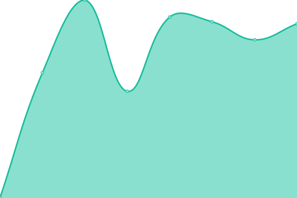
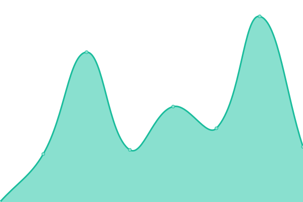

# [📈 Live Status](https://status.rikai.dev): <!--live status--> **🟧 Partial outage**

This repository contains the open-source uptime monitor and status page for [Upptime](https://upptime.js.org), powered by [Upptime](https://github.com/upptime/upptime).

With [Upptime](https://upptime.js.org), you can get your own unlimited and free uptime monitor and status page, powered entirely by a GitHub repository. We use [Issues](https://github.com/upptime/upptime/issues) as incident reports, [Actions](https://github.com/rikaisolutions/status/actions) as uptime monitors, and [Pages](https://status.rikai.dev) for the status page.

<!--start: status pages-->
<!-- This summary is generated by Upptime (https://github.com/upptime/upptime) -->
<!-- Do not edit this manually, your changes will be overwritten -->
<!-- prettier-ignore -->
| URL | Status | History | Response Time | Uptime |
| --- | ------ | ------- | ------------- | ------ |
|  [Rikai Website](https://www.rikai.ch) | 🟥 Down | [rikai-website.yml](https://github.com/rikaisolutions/status/commits/HEAD/history/rikai-website.yml) | 

 1080ms
     
 | 

<a href="https://status.rikai.dev/history/rikai-website">99.82%</a>
    

|  [Rikai App](https://app.rikai.ch) | 🟩 Up | [rikai-app.yml](https://github.com/rikaisolutions/status/commits/HEAD/history/rikai-app.yml) | 

 1223ms
     
 | 

<a href="https://status.rikai.dev/history/rikai-app">100.00%</a>
    

|  [Home Sampling Website](https://www.homesampling.ch) | 🟩 Up | [home-sampling-website.yml](https://github.com/rikaisolutions/status/commits/HEAD/history/home-sampling-website.yml) | 

 1087ms
     
 | 

<a href="https://status.rikai.dev/history/home-sampling-website">100.00%</a>
    

|  [Home Sampling App](https://app.rikai.ch) | 🟩 Up | [home-sampling-app.yml](https://github.com/rikaisolutions/status/commits/HEAD/history/home-sampling-app.yml) | 

 123ms
     
 | 

<a href="https://status.rikai.dev/history/home-sampling-app">100.00%</a>
    

|  [Invenimus Website](https://www.invenimus.ch) | 🟩 Up | [invenimus-website.yml](https://github.com/rikaisolutions/status/commits/HEAD/history/invenimus-website.yml) | 

 1210ms
     
 | 

<a href="https://status.rikai.dev/history/invenimus-website">100.00%</a>
    

<!--end: status pages-->

[**Visit our status website →**](https://status.rikai.dev)

## 📄 License

- Powered by: [Upptime](https://github.com/upptime/upptime)
- Code: [MIT](./LICENSE) © [Upptime](https://upptime.js.org)
- Data in the `./history` directory: [Open Database License](https://opendatacommons.org/licenses/odbl/1-0/)
